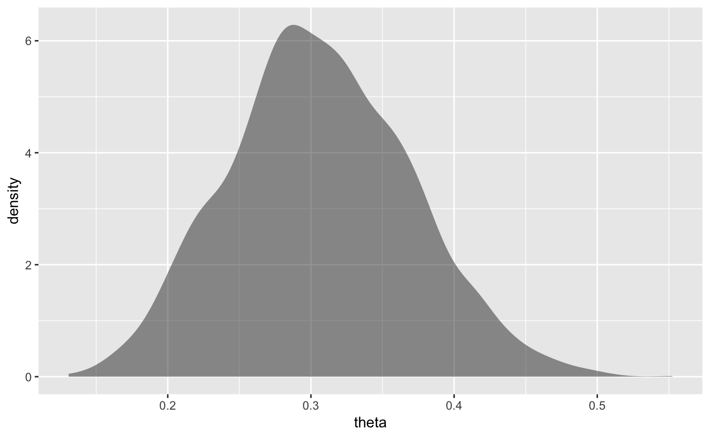

<!-- README.md is generated from README.Rmd. Please edit that file -->

# CalvinBayes

The goal of CalvinBayes is to collect up some data sets and utilities
for learning/teaching Bayesian Data analysis.

## Installation

### Github

You can install the development version of CalvinBayes from GitHub with

``` r
devtools::install_github("rpruim/CalvinBayes")
```

### CRAN

This package is not on
CRAN.

<!-- You can install the released version of CalvinBayes from [CRAN](https://CRAN.R-project.org) with: -->

<!-- ``` r -->

<!-- install.packages("CalvinBayes") -->

<!-- ``` -->

## Example

Here is an example that demonstrates the use of the `posterior()`
function to extract isamples from the posterior distribution of an
object fit using the R2jags package.

``` r
library(R2jags)
library(CalvinBayes)
data("z15N50")
glimpse(z15N50)
#> Observations: 50
#> Variables: 1
#> $ y <dbl> 0, 1, 0, 0, 0, 0, 0, 0, 0, 0, 1, 0, 0, 0, 1, 1, 1, 0, 0, 1, 0,…
```

``` r
# describe the model
bern_model <- function() {
  for (i in 1:N) {
    # each response is Bernoulli with fixed parameter theta
    y[i] ~ dbern(theta)  
  }
  theta ~ dbeta(1, 1)    # prior for theta
}
```

``` r
# Fit the model
bern_jags <- 
  jags(
    data = list(y = z15N50$y, N = nrow(z15N50)),
    model.file = bern_model,
    parameters.to.save = c("theta")
  )
#> module glm loaded
#> Compiling model graph
#>    Resolving undeclared variables
#>    Allocating nodes
#> Graph information:
#>    Observed stochastic nodes: 50
#>    Unobserved stochastic nodes: 1
#>    Total graph size: 53
#> 
#> Initializing model
```

``` r
glimpse(posterior(bern_jags))
#> Observations: 3,000
#> Variables: 2
#> $ deviance <dbl> 61.15448, 63.39155, 61.29829, 61.09542, 61.21761, 61.49…
#> $ theta    <dbl> 0.3170819, 0.4034269, 0.2707632, 0.3061688, 0.2768908, …
library(ggformula)
gf_density(~ theta, data = posterior(bern_jags))
```


